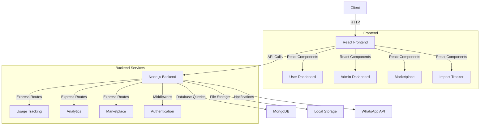

# 🌍 Sustainable Solutions Platform - Technotronics Hackathon 2025

<div align="center">
  
  
  [](https://unstop.com/o/a4ckfLJ?lb=atOHATDg&utm_medium=Share&utm_source=shortUrl)
  []()
</div>


## 🏆 Hackathon Submission
    
#### This project was developed for the Technotronics 2025, Dnyanprassarak Mandal's College and Research Centre, Goa.


## 💡 Problem Statement

#### Addressing Environmental and Health Risks of Paper Cups

- Raises Awareness
- Encourages Sustainable Behaviour
- Tracks Impact
- Facilitates Collaboration


## 💡 Our Solution

### Our platform is a web-based application designed to raise awareness and promote sustainability by recommending environmentally friendly alternatives.


<div align="center">
  
</div>

### Key Features

1. **Paper Cup Usage Tracking** ✅
   - Tracks paper cup consumption across campus
   - Monitors individual student usage patterns
   - Campus sustainability leaderboard system

2. **Awareness Portal** ✅
   - Educational resources about paper cup environmental impact
   - Real-time campus sustainability metrics
   - Interactive carbon footprint calculator

3. **Eco-Alternative Marketplace** ✅
   - Curated selection of reusable cup options
   - Direct connections with eco-friendly vendors
   - Bulk purchase options for institutions

4. **Impact Dashboard** ✅
   - Visualizes environmental impact reduction
   - Tracks money saved through sustainable alternatives
   - Community success stories and best practices
   - Progress tracking towards sustainability goals


## 🔄 Architecture

#### Our platform uses a simple three-tier architecture with React frontend, Node.js backend, and MongoDB database.



### 🔄 Component Relationships
- Home Page → Usage Dashboard/Marketplace
- Dashboard → Impact Analytics
- Marketplace → Product Listings
- Admin Panel → Usage Statistics & Reports

<br>


### 🔄 Component Relationships
- Home Page → Registration/Directory
- Directory → Individual Profiles
- Admin Dashboard → Profile Management
- Profile → Messaging System

<br>
<hr>

## 🛠️ Technology Stack

<div class="tech-grid" style="display: flex; gap: 20px;">
  
  
  
  
  
  
</div>

<br>

- **Frontend**: React.js with TypeScript
- **Backend**: Node.js
- **Database**: MongoDB
- **File Storage**: AWS S3
- **Notifications**: Twilio WhatsApp API
- **Styling**: Tailwind CSS
- **Deployment**: Docker


## 🚀 Installation & Setup

1. **Clone the repository:**
   ```bash
   git clone https://github.com/yourusername/sustainable-solutions-platform.git
   cd sustainable-solutions-platform
   ```

2. **Backend Setup:**
   ```bash
   # Navigate to backend directory
   cd backend

   # Install dependencies
   npm install

   # Create .env file
   cp .env.example .env

   # Update .env with your credentials
   MONGODB_URI=mongodb://localhost:27017/sustainable-solutions
   PORT=8080

   # Start the backend server
   npm run dev
   ```

3. **Frontend Setup:**
   ```bash
   # Open a new terminal
   cd frontend

   # Install dependencies
   npm install

   # Start the frontend development server
   npm run dev
   ```

4. **Database Setup:**
   - Open MongoDB Compass
   - Connect to: `mongodb://localhost:27017`
   - Create a new database named `sustainable-solutions`
   - Create collections: `cup_usage`, `users`, `vendors`

5. **Verify Setup:**
   - Backend should be running on: `http://localhost:8080`
   - Frontend should be running on: `http://localhost:5173`
   - MongoDB should be connected (check backend console)
   - MongoDB Compass should show your database

   

### Troubleshooting
- If MongoDB fails to connect, ensure the MongoDB service is running.
- If ports are occupied, update the `PORT` in the backend `.env` file.
- For frontend build issues, try clearing the npm cache:
  ```bash
  npm cache clean --force
  ```
- If the backend server does not start, check for any errors in the console and ensure all dependencies are installed correctly.
- If the frontend does not load, verify that the backend is running and accessible at `http://localhost:8080`.
- For issues with WhatsApp notifications, ensure that the Twilio API credentials are correctly set in the `.env` file.

## 📱 Features & Screenshots

<div align="center">
  
  
</div>

### Feature Highlights
- **Paper Cup Usage Tracking**: Monitors individual and campus-wide paper cup consumption.
- **Awareness Portal**: Provides educational resources on the environmental impact of paper cups.
- **Eco-Alternative Marketplace**: Offers a curated selection of reusable cup options and eco-friendly vendors.
- **Impact Dashboard**: Visualizes environmental impact reduction and tracks savings from sustainable alternatives.

## 🎯 Future Scope
- [ ] AI-powered recommendations for sustainable products
- [ ] Integration of a mobile application for on-the-go tracking
- [ ] Advanced analytics dashboard for deeper insights into usage patterns
- [ ] Community engagement features for sharing success stories
- [ ] Gamification elements to encourage sustainable behavior among users

<hr>

## Team Details
|Sr no.| Name | GitHub |
|------|------|--------|
|1.| Rudra Pratap Singh | [@Rudra00codes](https://github.com/Rudra00codes) |
|2.| Anant Srivastava | [@RoboShep](https://github.com/Robo-Shep)|
|3.| Tushar |[@codingnoobno1](https://github.com/codingnoobno1)|
<br>


## 🙏 Acknowledgments
- Technotronics Team for the opportunity
- All open-source libraries used in this project

## 📄 License

####  This project is licensed under the MIT License - see the LICENSE.md file for details.


