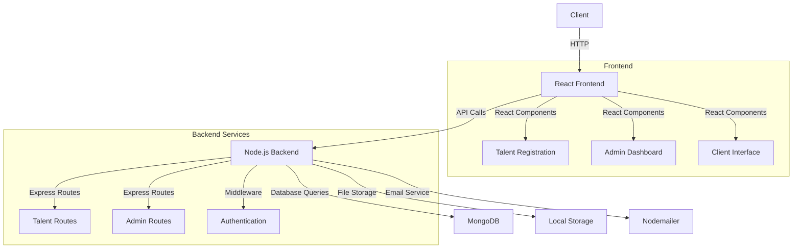

# 🎯 Awareness Grabbing Platform - Techtronics Hackathon 2025

<div align="center">
  
  
  [](https://unstop.com/o/a4ckfLJ?lb=atOHATDg&utm_medium=Share&utm_source=shortUrl)
  []()
</div>


## 🏆 Hackathon Submission
    
#### This project was developed for the Techtronics 2025, Dnyanprassarak Mandal's College and Research Centre, Goa.


## 💡 Problem Statement

<div style="display: flex; align-items: center; gap: 20px;">
  <div>

#### Tech-Driven Solutions to Address the Dual Threat of Paper Cups – Environmental Problems and Health Risks:

- Raises Awareness
- Encourages Sustainable Behaviour
- Tracks Impact
- Facilitates Collaboration
  </div>
</div>


## 💡 Our Solution
### Our solution is a Web platform that increases Awareness and encourages Sustainability while recommending environmentally friendlier options.

<div align="center">
  
</div>

### Key Features Implemented
1. **Waste Tracking** ✅
   - Tracks waste produced by a campus
   - Tracks the amount of wate produced per student
   - Campus leaderboard System

2. **Web applications** ✅
   - Clean, responsive UI
   - Advanced search and filters
   - Accessible by anyone

3. **Replacment Marketplace** ✅
   - Seamless browsing experience
   - Companies can provide enviornmentally friendlier options
   - Usefull for both Campuses and Students

4. **Community Dashboard** ✅
   - can detail situtaions and hurdles faced for overcoming the problems
   - a good way to help an up and coming solution
   - Analytics and reporting

<!-- ## 🖥️ Demo & Screenshots

<div align="center">
  
  
</div> -->

<!-- ### 🔗 Live Demo
- [Frontend Application](https://your-demo-link.com)
- [Admin Dashboard](https://your-admin-demo.com)
- [Demo Video](https://youtube.com/your-demo-video) -->

## 📊 Architecture

#### The Talent Platform uses a simple three-tier architecture with React frontend, Node.js backend, and MongoDB database.



<br>


### 🔄 Component Relationships
- Home Page → Registration/Directory
- Directory → Individual Profiles
- Admin Dashboard → Profile Management
- Profile → Messaging System

<br>
<hr>

## 🛠️ Technology Stack

<div class="tech-grid" style="display: flex; gap: 20px;">
  
  
  
  
  
</div>

<br>

- **Frontend**: React.js with TypeScript
- **Backend**: Node.js
- **Database**: MongoDB
- **File Storage**: AWS S3
- **Notifications**: Twilio WhatsApp API
- **Styling**: Tailwind CSS

## 🚦 Getting Started

### Prerequisites
- Node.js (v18 or higher)
- npm (v9 or higher)
- MongoDB (v6 or higher)
- MongoDB Compass (for database management)
- Git vcs

### Required Dependencies

<details>
  <summary>Check the list</summary>

#### Frontend
```bash
# Core Dependencies
npm create vite@latest talent-platform-frontend -- --template react-ts
cd talent-platform-frontend
npm install

# Additional Dependencies
npm install axios react-router-dom react-toastify
npm install -D tailwindcss postcss autoprefixer
npx tailwindcss init -p
```

- React 18
- TypeScript
- Vite
- Tailwind CSS
- Axios
- React Router DOM
- React Toastify

#### Backend
```bash
# Create and setup backend
mkdir backend
cd backend
npm init -y
npm install typescript ts-node @types/node -D
npx tsc --init

# Core Dependencies
npm install express mongoose cors dotenv

# Additional Dependencies
npm install multer nodemailer
npm install @types/express @types/cors @types/multer @types/nodemailer -D
```

- Express.js
- MongoDB/Mongoose
- TypeScript
- Cors
- Dotenv
- Multer (for file uploads)
- Nodemailer (for email notifications)

</details>


## 🚀 Installation & Setup

1. **Clone the repository:**
   ```bash
   git clone https://github.com/yourusername/talent-platform.git
   cd talent-platform
   ```

2. **Backend Setup:**
   ```bash
   # Navigate to backend directory
   cd backend

   # Install dependencies
   npm install

   # Create .env file
   cp .env.example .env

   # Update .env with your credentials
   MONGODB_URI=mongodb://localhost:27017/talent-platform
   PORT=8080

   # Start the backend server
   npm run dev


3. **Frontend Setup:**
   ```bash
   # Open a new terminal
   cd talent-platform-frontend

   # Install dependencies
   npm install

   # Start the frontend development server
   npm run dev

4. **Database Setup:**
   - Open MongoDB Compass
   - Connect to: `mongodb://localhost:27017`
   - Create a new database named `talent-platform`
   - Create collections: `talents`, `users`, `requests`


5. **Verify Setup:**
   - Backend should be running on: `http://localhost:8080`
   - Frontend should be running on: `http://localhost:5173`
   - MongoDB should be connected (check backend console)
   - MongoDB Compass should show your database

   
### Running the Project

<details>
  <summary>Expand to View</summary>

1. **Start MongoDB:**
   - Ensure MongoDB service is running
   - Keep MongoDB Compass open for database monitoring

2. **Start Backend Server:**
   ```bash
   cd backend
   npm run dev
   ```

3. **Start Frontend Development Server:**
   ```bash
   cd talent-platform-frontend
   npm run dev
   ```

4. **Access the Application:**
   - Frontend: `http://localhost:5173`
   - Backend API: `http://localhost:8080`
   - Admin Dashboard: `http://localhost:5173/admin`

### Troubleshooting
- If MongoDB fails to connect, ensure the MongoDB service is running
- If ports are occupied, update PORT in backend `.env`
- For frontend build issues, try clearing npm cache:
  ```bash
  npm cache clean --force

</details>

## 📱 Features & Screenshots

<div align="center">
  
  
</div>

### Feature Highlights
- **Smart Form Validation**: Real-time validation with helpful error messages
- **Responsive Design**: Works seamlessly on all devices
- **Secure File Upload**: Support for profile photo upload with preview
- **Admin Controls**: Comprehensive dashboard for profile management

## 🎯 Future Scope
- [ ] AI-powered solutions
- [ ] Video interview integration
- [ ] Blockchain-based skill verification
- [ ] Mobile application
- [ ] Advanced analytics dashboard

<hr>

## Team Details
|Sr no.| Name | GitHub |
|------|------|--------|
|1.| Rudra Pratap Singh | [@Rudra00codes](https://github.com/Rudra00codes) |
|2.| Anant Srivastava | [@RoboShep](https://github.com/Robo-Shep)|
|3.| Tushar |[@codingnoobno1](https://github.com/codingnoobno1)|
<br>

# Create a zip file

```bash
zip -r talent-platform.zip talent-platform/ \
   -x "talent-platform/node_modules/*" \
   -x "talent-platform/*/node_modules/*" \
   -x "talent-platform/.git/*" \
   -x "talent-platform/*/.env"
```
## 🙏 Acknowledgments
- JPD Hub for the opportunity
- Advitiya IIT Ropar for hosting
- All open-source libraries used in this project

## 📄 License

This project is licensed under the MIT License - see the LICENSE.md file for details.


