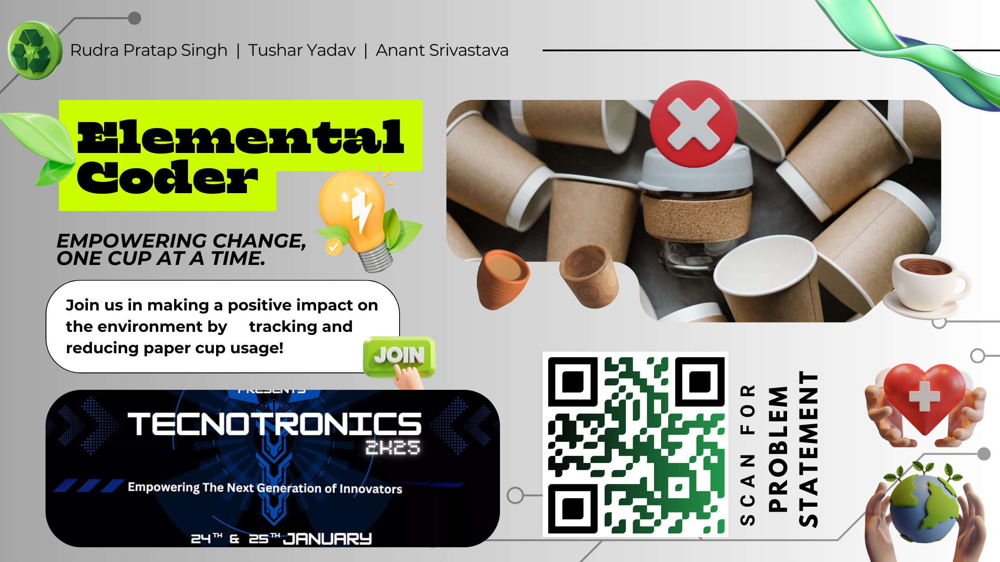
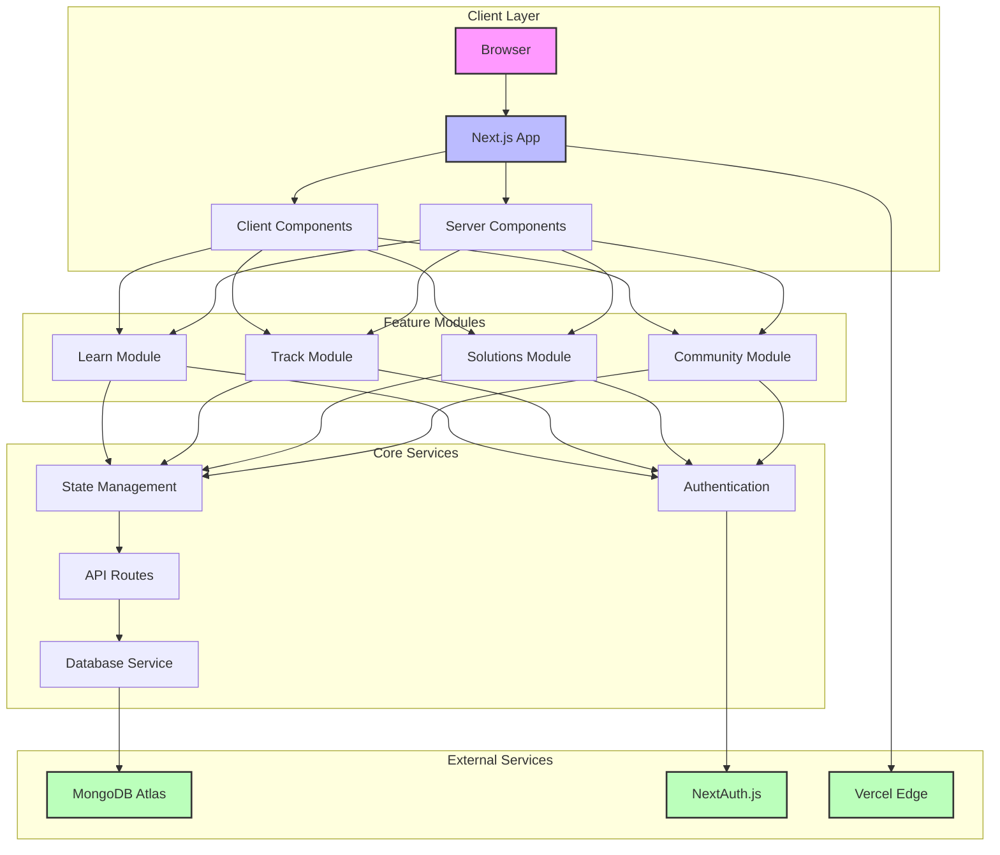

# 🌍 EcoCup - Sustainable Solutions Platform - Technotronics Hackathon 2025
 
<div align="center">
   
   
  
  [](https://unstop.com/o/a4ckfLJ?lb=atOHATDg&utm_medium=Share&utm_source=shortUrl)
  []()
  [](https://nextjs.org)
  [](https://tailwindcss.com)
</div>

## 🏆 Hackathon Project
This project was developed for Technotronics 2025, addressing the critical environmental and health challenges posed by disposable paper cups.

## 💡 Problem Statement
Disposable paper cups pose a dual threat:
1. **Environmental Impact**: Contributing to microplastic pollution and waste
2. **Health Risks**: Containing harmful chemicals like BPA that can leach into beverages

## 🎯 Our Solution
EcoCup is a comprehensive web platform that combines education, tracking, and community engagement to promote sustainable alternatives to paper cups.

### Key Features

#### 1. Learn 📚
- Detailed information about environmental impacts
- Health risk awareness
- Interactive educational content
- Real-world statistics and data

#### 2. Track & Rewards 🏆
- Personal usage dashboard
- Impact visualization
- Achievement system
- Campus-wide leaderboard
- Reward redemption system

#### 3. Solutions 🌱
- Eco-friendly product recommendations
- Campus initiatives
- Sustainable practices guide
- Refill station locations

#### 4. Community 👥
- Success stories
- Group discussions
- Event organization
- Collaborative initiatives

## 🏗️ Project Structure

```
src/
├── app/                    # Next.js app directory
│   ├── learn/             # Educational content
│   ├── track/             # Impact tracking & rewards
│   ├── solutions/         # Sustainable alternatives
│   ├── community/         # Community features
│   └── page.js            # Home page
├── components/
│   ├── common/           # Reusable UI components
│   ├── features/         # Feature-specific components
│   │   ├── learn/
│   │   ├── track/
│   │   ├── solutions/
│   │   └── community/
│   └── layout/           # Layout components
├── lib/                  # Shared utilities
│   ├── utils/
│   ├── hooks/
│   └── api/
└── styles/              # Global styles
```

## 🏗️ Architecture

Our application follows a modern Next.js 14 architecture with server and client components, leveraging the App Router for improved performance and SEO.


```mermaid
graph TD
    subgraph "Client Layer"
        A[Browser] --> B[Next.js App]
        B --> C1[Client Components]
        B --> C2[Server Components]
    end

    subgraph "Feature Modules"
        D1[Learn Module]
        D2[Track Module]
        D3[Solutions Module]
        D4[Community Module]
        
        C1 --> D1
        C1 --> D2
        C1 --> D3
        C1 --> D4
        
        C2 --> D1
        C2 --> D2
        C2 --> D3
        C2 --> D4
    end

    subgraph "Core Services"
        E1[Authentication]
        E2[State Management]
        E3[API Routes]
        E4[Database Service]
        
        D1 --> E1
        D2 --> E1
        D3 --> E1
        D4 --> E1
        
        D1 --> E2
        D2 --> E2
        D3 --> E2
        D4 --> E2
        
        E2 --> E3
        E3 --> E4
    end

    subgraph "External Services"
        F1[MongoDB Atlas]
        F2[NextAuth.js]
        F3[Vercel Edge]
        
        E4 --> F1
        E1 --> F2
        B --> F3
    end

    style A fill:#f9f,stroke:#333,stroke-width:2px
    style B fill:#bbf,stroke:#333,stroke-width:2px
    style F1 fill:#bfb,stroke:#333,stroke-width:2px
    style F2 fill:#bfb,stroke:#333,stroke-width:2px
    style F3 fill:#bfb,stroke:#333,stroke-width:2px
```

<details><summary>Architecture Components</summary>

### Architecture Components

#### 1. Client Layer
- **Browser**: Entry point for user interactions
- **Next.js App**: Core application framework
- **Client Components**: Interactive UI elements
- **Server Components**: Static and dynamic server-rendered content

#### 2. Feature Modules
- **Learn Module**: Educational content and resources
- **Track Module**: Usage tracking and rewards system
- **Solutions Module**: Sustainable alternatives showcase
- **Community Module**: User interaction and collaboration

#### 3. Core Services
- **Authentication**: User identity management
- **State Management**: Client-side data handling
- **API Routes**: Server-side endpoints
- **Database Service**: Data persistence layer

#### 4. External Services
- **MongoDB Atlas**: Cloud database
- **NextAuth.js**: Authentication provider
- **Vercel Edge**: Hosting and deployment

### Key Design Principles

1. **Server-First Approach**
   - Leverage Server Components for better performance
   - Reduce client-side JavaScript
   - Improve SEO through server-side rendering

2. **Modular Architecture**
   - Feature-based organization
   - Reusable components
   - Clear separation of concerns

3. **Performance Optimization**
   - Edge caching
   - Image optimization
   - Route prefetching

4. **Security**
   - Authentication middleware
   - API route protection
   - Environment variable security
   
</details>

## 🛠️ Technology Stack

- **Framework**: Next.js 14
- **Styling**: Tailwind CSS
- **State Management**: React Hooks
- **Database**: MongoDB (planned)
- **Authentication**: NextAuth.js (planned)
- **Deployment**: Vercel (planned)

## 🚀 Getting Started

1. **Clone the repository:**
   ```bash
   git clone https://github.com/Rudra00codes/Elemental-Coders.git
   cd Elemental-Coders
   ```

2. **Install dependencies:**
   ```bash
   npm install
   # or
   yarn install
   ```

3. **Run the development server:**
   ```bash
   npm run dev
   # or
   yarn dev
   ```

4. **Open your browser:**
   Navigate to [http://localhost:3000](http://localhost:3000)

## 📱 Features Preview

### Learn Page
- Environmental impact education
- Health risk awareness
- Interactive statistics
- Call to action for sustainable choices

### Track & Rewards Page
- Personal impact dashboard
- Points system
- Reward redemption
- Campus leaderboard

### Solutions Page
- Sustainable product recommendations
- Campus initiatives
- Refill station locations
- Best practices guide

### Community Page
- Discussion forums
- Event organization
- Success stories
- Collaborative initiatives

## 🎯 Future Enhancements

- [ ] User Authentication System
- [ ] MongoDB Integration for Data Persistence
- [ ] Real-time Usage Tracking
- [ ] QR Code Integration for Cup Usage
- [ ] Mobile App Development
- [ ] Integration with Campus Payment Systems
- [ ] AI-powered Usage Predictions
- [ ] Automated Impact Reports

## 👥 Contributing

We welcome contributions! Please feel free to submit a Pull Request.

## 📄 License

This project is licensed under the MIT License - see the [LICENSE](LICENSE) file for details.

## 🙏 Acknowledgments

- Dnyanprassarak Mandal's College and Research Centre, Goa
- Technotronics 2025 Organizing Team
- All contributors and supporters
